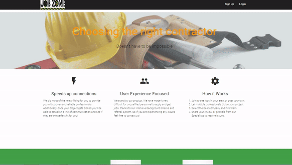
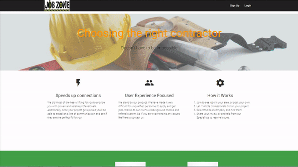
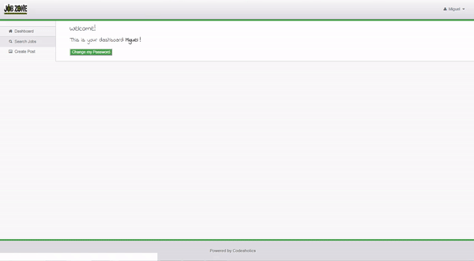
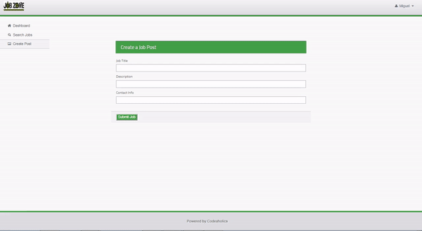
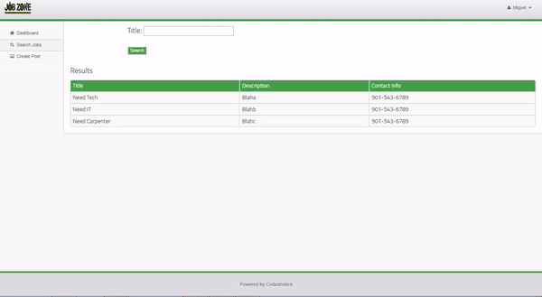

# Job Zone (Project 2)
A job-searching/job-posting application that uses Node.js, Express, MySQL, Passport.js(Authentication), EJS, Materialize, & Bootstrap.

## Description

This website demonstrates a full stack application with a front end implemented with HTML/CSS and elements from Materialize & Bootstrap's framework and the backend implemented with Node.js and Express. HTML templating is done with the help of EJS View Engine.

The user is welcomed with the homescreen, which shows a little about the app itself, plus some recent customer reviews and our business contact information.

Then, the user can create his/her Login credentials by clicking on "SIGN UP". Once the new user's profile has been created, they can login into the site and start using all of the main site's functionlities (like "Create a Post", "Search Posts", etc).

### Additional facts:

* The user can change his/her password through Dashboard, or Clicking on "My Account" from the username's drop-down menu on the right side of the screen. User Data gets accessed on our Database and updated with the new password.

* On Create a Post, the user can fill the input fields and create a Post. Once this step is completed, this data will be saved in the database and redirect to Search Post page.

* On Search Posts, the user types for a particular category or key words (like "carpenter"), and after clicking on "Search", the app will search the database and if it finds an entry, it will return it.

* Log out option (located on the username's drop-down menu), will destroy local session. And rediect to homepage.  

## Demo

The demo of this application can be found [here](https://codeaholics-jobzone.herokuapp.com/).

## Installation

To run the application locally, first clone this repository with the following command.

	git clone https://github.com/miguelaw/Job.Zone.git
	
Access to the project's folder

	cd Job.Zone

Next, install the application dependencies.

	npm install
	
Finally, run the node server locally.

	node server.js

	
Now, open the local application on port 8080 at the URL: `http://localhost:8080/`.

**Thank you for checking out our work!**

